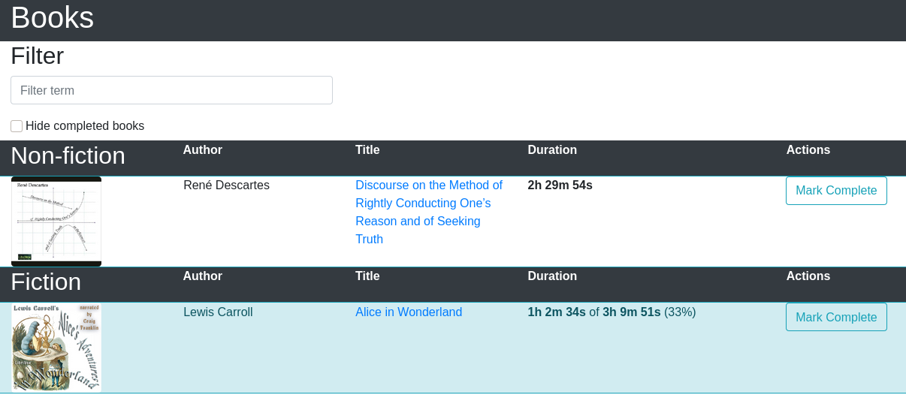
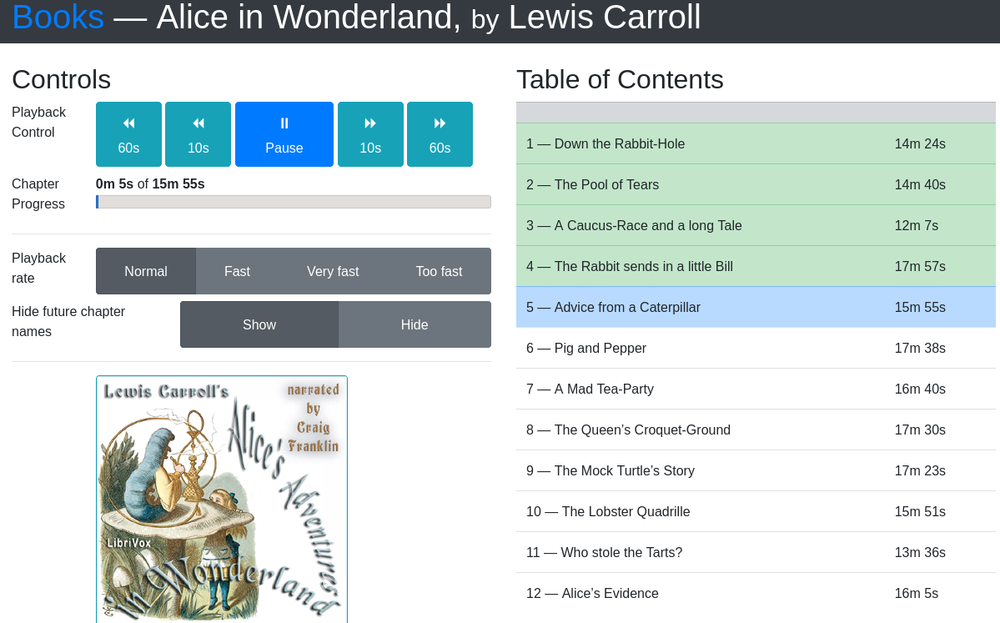

# Static Site Generator for Audiobooks
*I don't know how to name projects*

[See a demo](http://static-audiobooks-demo.s3-website-ap-southeast-1.amazonaws.com)

## What is this?
### From the end-user's point of view
A web based audiobook browser and player. There are no accounts, there is no progress sync, there are no cookies (LocalStorage is used to remember progress), it's a straightforward flow of 1) loading a page 2) picking a book and 3) listening.

Here are a couple of screenshots:

*The index page*


*Listening to a specific book*


### From the administrator's point of view
This project will allow importing an existing audiobook library and, from that, create a static website which contains an index page and a page for each book. This can be hosted on any web server which supports *Range* headers (most servers).

The static content (including media) can be hosted on a local nginx instance, or on something like Amazon S3.

If you want to add some form of authentication or access control, that's left as an exercise for the administrator.

## Who is this for?
Initially I made this to allow my not-very-technically-able parents to listen to audiobooks. I intend to keep it that way; a simple UI/UX with no hidden options.

I also aim for this to be usable by those who perhaps don't have the best eyesight (hence have trouble reading books), meaning that important interactive UI elements should be large and meaningfully coloured.

As for the who can administer this, someone who is OK using python, configuring nginx and has a server somewhere to run this.

[](https://asciinema.org/a/LBjHoZrzC6VTTzlEjaGwuLQoL)

## Workflows
### Importing audiobooks
TL/DR;
1. Have library organised as `…/author/title/{chapter1,chapter2,…}.mp3`
2. `./import.py /path/to/library`
3. Edit `manifests/index.json`, to set which books to index, and in what order
4. Optionally edit the `.json` manifest of newly imported books
5. `./generate.py`
6. Copy `public/` to web server
7. You're done, browse to your server and enjoy

You likely have an existing Audiobook collection, but here we'll assume you don't and download some sample books, which we'll then use to build our static website

#### Picking some sample books
First, let's get some sample books from [librivox](https://librivox.org). Let's get one fiction book and one non-fiction book.
- [Alice in Wonderland](https://librivox.org/alices-adventures-in-wonderland-version-7-by-lewis-carroll/) by Lewis Carroll
- [Discourse on the Method of Rightly Conducting One’s Reason and of Seeking Truth](https://librivox.org/discourse-on-the-method-by-rene-descartes/) by René Descartes

#### Setting up our media folders
The python scripts assume that your library is set up as:
```
├── Lewis Carroll
│   └── Alice in Wonderland
│       ├── cover.jpg
│       ├── foo - chapter 1.mp3
│       ├── foo - chapter 2.mp3
…
```

Actually the filenames don't matter much. However:
- The cover image is required
- The cover image must be a `.jpg`
- If there are multiple jpg files, the first one alphanumerically will be used
- Audio files must be `.mp3`
- Audio files must be in alphanumeric order

Let's set up our audiobook library. This is completely separate to this git repository and can be on some home NAS.

```bash
mkdir Audiobooks
cd Audiobooks
# Download the 2 audiobooks, these links are most likely unstable, but they're here for completion
wget -c http://www.archive.org/download/discourse_method_librivox/discourse_method_librivox_64kb_mp3.zip \
    http://www.archive.org/download/alicesadventuresinwonderland_2005_librivox/alicesadventuresinwonderland_2005_librivox_64kb_mp3.zip

mkdir -vp "René Descartes/Discourse on the Method of Rightly Conducting One’s Reason and of Seeking Truth" "Lewis Carroll/Alice in Wonderland"

unzip discourse_method_librivox_64kb_mp3.zip -d "René Descartes/Discourse on the Method of Rightly Conducting One’s Reason and of Seeking Truth"
unzip alicesadventuresinwonderland_2005_librivox_64kb_mp3.zip -d "Lewis Carroll/Alice in Wonderland"
```
Since librivox's zip files doesn't include cover images, let's get some of those manually;
```bash
wget -O "Lewis Carroll/Alice in Wonderland/cover.jpg" https://ia803200.us.archive.org/26/items/alicesadventuresinwonderland_2005_librivox/alicewonderland7_2006.jpg
wget -O "René Descartes/Discourse on the Method of Rightly Conducting One’s Reason and of Seeking Truth/cover.jpg" https://ia802302.us.archive.org/13/items/discourse_method_librivox/Discourse_on_Method.jpg
```
Those aren't the best quality covers, and I would recommend getting better ones, but they'll do for now.

#### Importing our library
Now we have a functional audiobook library, let's import this. As a one-time setup we have to initialise the virtualenv of the python workspace. Git clone this project and `cd` into it, then:
```bash
virtualenv .virtualenv
source .virtualenv/bin/activate
pip install -r requirements.txt
```
On subsequent uses, you only need to activate the environment. I assume you know how to work with python projects. Then use the import script.
```bash
./import.py /media/Audiobooks
```

These files will now exist in `manifests/`:
```bash
$ tree manifests/
manifests/
├── index.json.sample
├── lewis-carroll-alice-in-wonderland.json
└── rené-descartes-discourse-on-the-method-of-rightly-conducting-ones-reason-and-of-seeking-truth.json
```

#### Deciding which books to list, and adding metadata
Create `manifests/index.json` (see the sample file). This file determines which books are ultimately shown, in what sections, and in what order. Also, each of the books' JSON files can optionally be edited to contain chapter names, instead of generic "Chapter 1, Chapter 2" names.

Let's create 2 sections on our site; "Fiction", "Non-Fiction". Then let's add both books accordingly. Set `manifests/index.json` to:
```json
{
  "sections": [{
      "name": "Non-fiction",
      "books": [{
        "id": "rené-descartes-discourse-on-the-method-of-rightly-conducting-ones-reason-and-of-seeking-truth",
        "source_dir": "/path/to/library/René Descartes/Discourse on the Method of Rightly Conducting One’s Reason and of Seeking Truth"
      }]
    },{
      "name": "Fiction",
      "books": [{
        "id": "lewis-carroll-alice-in-wonderland",
        "source_dir": "/path/to/library/Lewis Carroll/Alice in Wonderland"
      }]
    }
  ]
}
```
For each book, the `id` refers to the `.json` file for that book (and will later map to a URL), the `source_dir` refers to where the audio and cover files are stored.

Optionally, add chapter names to the books. Let's only do it for Alice in Wonderland for now. Open `manifests/lewis-carroll-alice-in-wonderland.json` and you'll see it has generic chapter names for now. Set the JSON to:
```
{
  "title": "Alice in Wonderland",
  "author": "Lewis Carroll",
  "parts": [
    {
      "name": "",
      "chapter_names": [
        "Down the Rabbit-Hole",
        "The Pool of Tears",
        "A Caucus-Race and a long Tale",
        "The Rabbit sends in a little Bill",
        "Advice from a Caterpillar",
        "Pig and Pepper",
        "A Mad Tea-Party",
        "The Queen’s Croquet-Ground",
        "The Mock Turtle’s Story",
        "The Lobster Quadrille",
        "Who stole the Tarts?",
        "Alice’s Evidence"
      ]
    }
  ]
}
```


### Generating the site
With the python virtual environment still active:
```bash
./generate.py --with-extension
```
You can also pass `-h` to see more options. This will generate `public/index.html`, the `.html` files for the two books, as well as copy all the needed files from the source directories into `public/media/`


### Deploying the site

You can test your generated site with `python -m http.server -d public`. If everything looks good, copy the `public` folder to your web server. It's suggested to first copy the media folder, then the rest. For instance using:
```bash
rsync --verbose --delete-after --ignore-existing -r public/media/ webserver:/var/www/media/
rsync --verbose --delete-after -r --exclude 'media/*' public/ webserver:/var/www/
```

### Deleting a book
You can hide a book my removing the reference to the book in `manifests/index.json` and running `./generate.py` and re-deploying that.

Note that `generate.py` doesn't delete files from `public/` which were placed there but are no longer needed, meaning the files from a hidden book would still be there. This is a known bug.


## By the way
### Webserver configs
I hide the `.html` extensions by omitting the `--with-extension` parameter to `./generate.py`. Then adding this to the nginx config:
```
try_files $uri $uri.html $uri/ =404;
```

### Hosting media in S3
If you want the .html files hosted locally, but the media hosted from AWS S3, call `./generate.py` with `--media-path https://bucket-name.s3.Region.amazonaws.com/book-media/` (replace appropriately). Then instead of copying `public/media/` to the web server, upload it to S3 (presumably with `--acl public-read --recursive`).


### Books with Parts / Sections / Acts
Some books group chapters into Parts, Sections or Acts. This is why there's a `parts` section in the JSON manifests of books. For instance, for Yuval Noah Harari's Sapiens, I use:
```
{
  "title": "Sapiens",
  "author": "Yuval Noah Harari",
  "parts": [{
      "name": "Part 1: The Cognitive Revolution",
      "chapter_names": ["An Animal of No Significance", "The Tree of Knowledge", "The Flood", "History's Biggest Fraud"
      ]
    },
    {
      "name": "Part 2: The Agricultural Resolution",
      "chapter_names": ["History's Biggest Fraud",
        "Building Pyramids",
        "Memory Overload",
        "There is No Justice in History"
      ]
    },
    {
      "name": "Part 3: The Unification of Humankind",
      "chapter_names": [
        "The Arrow of History",
        "The Scent of Money",
        "Imperial Visions",
        "The Law of Religion",
        "The Secret of Success"
      ]
    },
    {
      "name": "Part 4: The Scientific Revolution",
      "chapter_names": [
        "The Discovery of Ignorance",
        "The Marriage of Science and Empire",
        "The Capitalist Creed",
        "The Wheels of Industry",
        "A Permanent Revolution",
        "And They Lived Happily Ever After",
        "The End of Homo Sapiens"
      ]
    },
    {
      "name": "Afterword",
      "chapter_names": [
        "The Animal that Became a God"
      ]
    }
  ]
}
```

